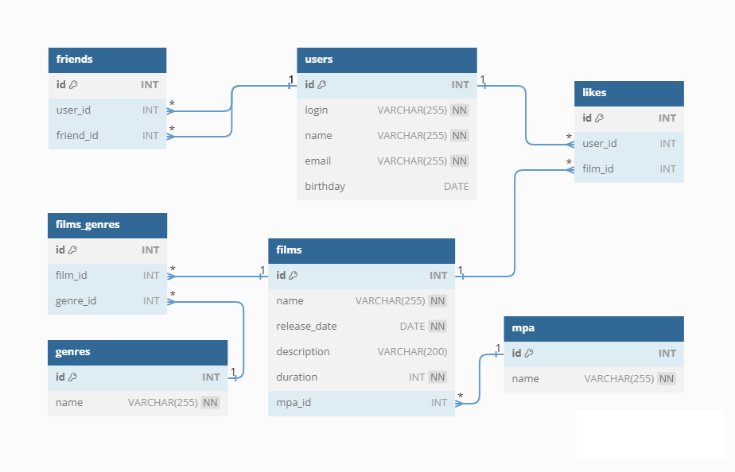

# JAVA-FILMORATE

## Описание

Проект "Filmorate" - платформа для составления рейтингов фильмов и объединения пользователей в комьюнити.

## Схема базы данных

## Пояснение к диаграмме

- Таблица friends содержит информацию о друзьях пользователей. Она включает столбцы id (идентификатор дружбы), user_id (идентификатор пользователя) и friend_id (идентификатор друга).
- Таблица users содержит информацию о пользователях. Она включает столбцы id (идентификатор пользователя), login (логин пользователя), name (имя пользователя), email (адрес электронной почты пользователя) и birthday (день рождения пользователя).
- Таблица likes содержит информацию о лайках. Она включает столбцы id (идентификатор лайка), user_id (идентификатор пользователя) и film_id (идентификатор фильма, которому поставлен лайк).
- Таблица genres содержит информацию о жанрах фильмов. Она включает столбцы id (идентификатор жанра) и name (название жанра).
- Таблица films_genres является сводной таблицей, которая устанавливает связь между фильмами и жанрами. Она включает столбцы id (идентификатор связи), film_id (идентификатор фильма) и genre_id (идентификатор жанра).
- Таблица films содержит информацию о фильмах. Она включает столбцы id (идентификатор фильма), name (название фильма), release_date (дата выхода фильма), description (описание фильма), duration (продолжительность фильма) и mpa_id (идентификатор рейтинга фильма по классификации MPA).
- Таблица mpa содержит информацию о рейтингах фильмов по классификации MPA. Она включает столбцы id (идентификатор рейтинга) и name (название рейтинга).
